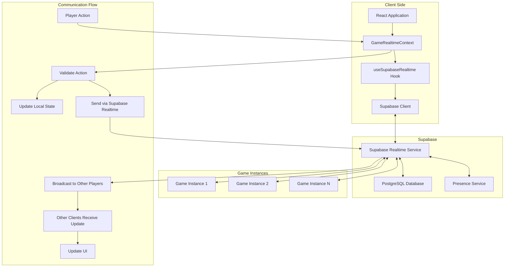

# Supabase Realtime Architecture

This document outlines the real-time communication architecture used in Map Painter IO, which is built on Supabase Realtime.

## Overview

Map Painter IO uses Supabase Realtime for all real-time communication between players. This includes:

- Player presence (who is online)
- Game state synchronization
- Player actions (claiming states, attacking)
- Resource updates

## Architecture Diagram

## Components

### Client Side

- **React Application**: The main application that users interact with.
- **GameRealtimeContext**: A React context that provides game-specific real-time functionality.
- **useSupabaseRealtime Hook**: A custom hook that manages Supabase Realtime connections.
- **Supabase Client**: The client library that connects to Supabase services.

### Supabase

- **Supabase Realtime Service**: Handles WebSocket connections and message broadcasting.
- **PostgreSQL Database**: Stores game state, player information, and other data.
- **Presence Service**: Tracks which players are online and their status.

### Game Instances

- Each game instance is a separate channel in Supabase Realtime.
- Players join a specific game instance to play together.
- Game state is synchronized within each instance.

## Communication Flow

1. **Player Action**: A player performs an action (e.g., claiming a state).
2. **Validate Action**: The action is validated locally to ensure it's valid.
3. **Update Local State**: The local state is updated optimistically.
4. **Send via Supabase Realtime**: The action is sent to Supabase Realtime.
5. **Broadcast to Other Players**: Supabase broadcasts the action to all other players in the game instance.
6. **Other Clients Receive Update**: Other clients receive the action.
7. **Update UI**: The UI is updated to reflect the action.

## Message Types

- **GAME_STATE**: Full game state update
- **PLAYER_JOINED**: A new player has joined the game
- **PLAYER_LEFT**: A player has left the game
- **STATE_CLAIMED**: A state has been claimed by a player
- **STATE_ATTACKED**: A state has been attacked by a player
- **RESOURCES_UPDATED**: Player resources have been updated
- **ERROR**: An error has occurred

## Presence

Presence is used to track which players are online. Each player's presence includes:

- Player ID
- Player name
- Player color
- Connection timestamp
- Last active timestamp

## Error Handling

- Connection errors are displayed to the user
- Reconnection is attempted automatically with exponential backoff
- Messages are queued when disconnected and sent when reconnected

## Performance Considerations

- Messages are kept small to minimize bandwidth usage
- State updates are optimistic to provide a responsive user experience
- Resource updates are batched to reduce message frequency
